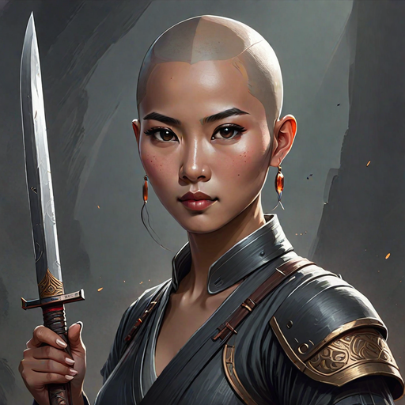

---
tags:
  - Characters
  - Female
  - Bakunawa
  - Lightbringer
  - Hanan
  - Lower Hanan
---

# Amihan Bakunawa

  <strong>Warning!</strong> This article contains spoilers from House of Light.

  
Amihan Bakunawa

  

    
    <em>AI-generated</em>
  

  
General Information

  <table>
    <tr><th>Full name</th><td>Amihan Bakunawa</td></tr>
    <tr><th>Also known as</th><td>
      <ul>
        <li>Ami</li>
      </ul>
    </td></tr>
    <tr><th>Species</th><td>Human</td></tr>
    <tr><th>Status</th><td>Alive</td></tr>
    <tr><th>Born</th><td>March 7, 519 AA</td></tr>
    <tr><th>Died</th><td>AA</td></tr>
    <tr><th>Gender</th><td>Female</td></tr>
    <tr><th>Written Name</th><td>ᜀᜋᜒᜑᜈ᜔ ᜊᜃᜓᜈᜏ</td></tr>
  </table>
  
Physical Description

  <table>
    <tr><th>Hair</th><td>Bald</td></tr>
    <tr><th>Eyes</th><td>Brown</td></tr>
    <tr><th>Height</th><td>5'6"</td></tr>
    <tr><th>Skin</th><td>dark</td></tr>
  </table>
  
Affiliations

  <table>
    <tr><th>Allegiance</th><td><a href="../world/">The Bakunawa</a></td></tr>
    <tr><th>Residence</th><td><a href="../locations/">Lower Hanan</a></td></tr>
    <tr><th>Occupation</th><td>Soldier</td></tr>
    <tr><th>Family</th><td>
      <ul>
        <li><a href="../">Habagat Bakunawa (twin brother, deceased)</a>
        <li><a href="../tadhana">Tadhana Bakunawa (adoptive cousin)</a>
        <li><a href="../">Mahalia Bakunawa (adoptive cousin, deceased)</a>
        <li><a href="../">Bayani Bakunawa (adoptive cousin, deceased)</a>
        <li><a href="../">Sinta Bakunawa (aunt, deceased)</a>
        <li><a href="../">Ulupong Bakunawa (uncle, deceased)</a>
      </ul>
    </td></tr>
  </table>

  
"It's nice to see you again, Amihan." "No, it's not."

  <footer>— Diwata, <a href="#">House of Shadow</a></footer>

**Amihan Bakunawa** (*pronounced: AH-meh-han*) is a Lightbringer of Hanan and cousin of <a href="../tadhana">Tadhana Bakunawa</a>.

## Biography
Amihan was born in Lower Hanan. She has a twin named Hagabat. She belongs to the Bakunawa clan, and works under the lieutenant and her adoptive cousin Tadhana.

### Early Life

*(Write the character's backstory here.)*

### Events of *House of Light*

*(Write what happens to this character in each book here.)*

## Personality
She is normally described as quiet and standoffish from a first impression; as you get to know her, she is empathetic and sensitive. She is observant, loyal, empathetic, but also sensitive, emotional, and standoffish.

As a hobby, Amihan loves to learn languages. She is fluent in Hanang (from Hanan), Lautang (from Lautan), Langitian (from Langit), Dok (Dokmai), and Bailang (common tongue). Additionally, she learned BSL (Bailang sign language) from Tadhana. She also created a language for her and her cousins called Bakun. She also has a secret language with her twin Hagabat, but know one else besides those two know what its called or how to speak it.

## Abilities & Powers

*(Describe the character's skills, magic, combat abilities, etc.)*

## Relationships

### Habagat
Amihan's twin brother. They are extremely close and often communicate in their secret twin language.

### Tadhana
Amihan is extremely loyal to Tadhana and trusts her leadership.

### Som
Amihan and Som eventually become best friends.

## Trivia

- Amihan first shaved her head as a child to get Tadhana's attention after she cut Mahalia's hair short. Amihan discovered she liked the style, and continued to sport a bald head.

## Appearances

- *House of Light*

  <strong>Categories:</strong>
  <a href="../tags/#characters">Characters</a> ·
  <a href="../tags/#female">Female</a> ·
  <a href="../tags/#protagonists">Protagonists</a> ·
  <a href="../tags/#humans">Humans</a>

