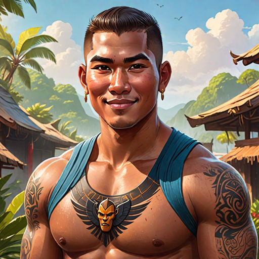

---
tags:
  - Characters
  - Male
  - Bakunawa
  - Hanan
---

# Habagat Bakunawa

  <strong>Warning!</strong> This article contains spoilers from House of Light.

  
Habagat Bakunawa

  

    
    <em>AI-generated</em>
  

  
General Information

  <table>
    <tr><th>Full name</th><td>Habagat Bakunawa</td></tr>
    <!-- <tr><th>Also known as</th><td>
      <ul>
        <li>The Ashen One</li>
        <li>Lady of Embers</li>
      </ul>
    </td></tr> -->
    <tr><th>Species</th><td>Human</td></tr>
    <tr><th>Status</th><td>Deceased</td></tr>
    <tr><th>Born</th><td>March 7, 519 AA</td></tr>
    <tr><th>Died</th><td>543 AA</td></tr>
    <tr><th>Gender</th><td>Male</td></tr>
    <tr><th>Written Name</th><td>ᜑᜊᜄᜆ᜔ ᜊᜃᜓᜈᜏ</td></tr>
  </table>
  
Physical Description

  <table>
    <tr><th>Hair</th><td>short and dark</td></tr>
    <tr><th>Eyes</th><td>brown</td></tr>
    <tr><th>Height</th><td>5'9"</td></tr>
    <tr><th>Skin</th><td>dark</td></tr>
  </table>
  
Affiliations

  <table>
    <tr><th>Allegiance</th><td><a href="../world/">The Bakunawa Clan</a></td></tr>
    <tr><th>Residence</th><td><a href="../locations/">Lower Hanan</a></td></tr>
    <tr><th>Occupation</th><td>Enforcer</td></tr>
    <tr><th>Family</th><td>
      <ul>
        <li><a href="../amihan">Amihan Bakunawa (twin sister)</a>
        <li><a href="../tadhana">Tadhana Bakunawa (adoptive cousin)</a>
        <li><a href="../mahalia">Mahalia Bakunawa (adoptive cousin, deceased)</a>
        <li><a href="../bayani">Bayani Bakunawa (adoptive cousin, deceased)</a>
        <li><a href="../sinta">Sinta Bakunawa (aunt, deceased)</a>
        <li><a href="../ulupong">Ulupong Bakunawa (uncle, deceased)</a>
      </ul>
    </td></tr>
  </table>

<!-- 

  
I was not born of flame. I was born beside it — close enough to be scarred, close enough to learn its shape.

  <footer>— Lyra, <a href="#">House of Light</a></footer>

 -->

**Habagat Bakunawa** (*pronounced: hah-bah-GAHT*) was an enforcer for the Bakunawa clan and twin brother to <a href="../amihan">Amihan Bakunawa</a>.

## Biography

### Early Life

*(Write the character's backstory here.)*

### Events of *House of Light*

*(Write what happens to this character in each book here.c)*

## Personality
Habagat was often described as loud and booming, friendly, and outgoing. He loved to cook, fight, and work out his muscles. He was notable for his loud, booming laugh.

## Abilities & Powers

*(Describe the character's skills, magic, combat abilities, etc.)*

## Relationships

### [Character Name]

*(Describe the relationship between Lyra and this character.)*

## Trivia

- *(Interesting behind-the-scenes fact or fun detail.)*

## Appearances

- *House of Light* — protagonist

  <strong>Categories:</strong>
  <a href="../tags/#characters">Characters</a> ·
  <a href="../tags/#male">Male</a> ·
  <a href="../tags/#protagonists">Protagonists</a> ·
  <a href="../tags/#humans">Humans</a>

