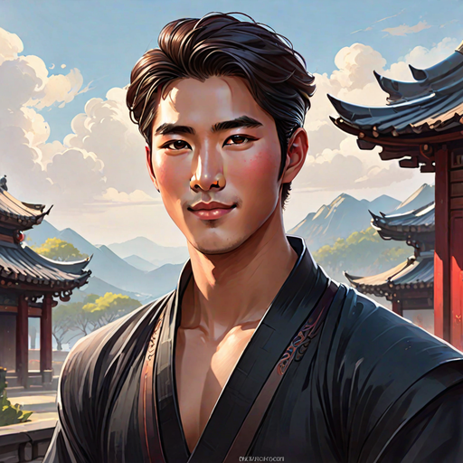
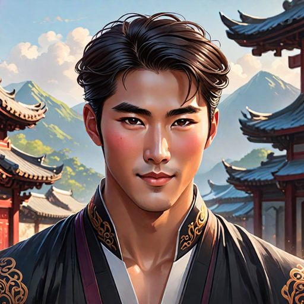
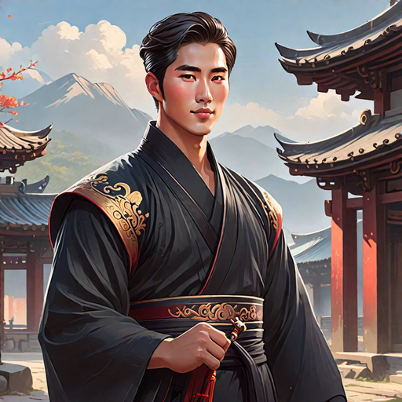

---
tags:
  - Characters
  - Male
  - Lightbringer
  - Yinying
  - Royalty
---

# Jinhai Nangong

  <strong>Warning!</strong> This article contains spoilers from House of Light.

  
Jinhai Nangong

    

      <input type="radio" name="jinhai-carousel" id="tc1" checked>
      <input type="radio" name="jinhai-carousel" id="tc2">
      <input type="radio" name="jinhai-carousel" id="tc3">
      

        

        

        

      

      

        <label for="tc1"></label>
        <label for="tc2"></label>
        <label for="tc3"></label>
      

    

  
General Information

  <table>
    <tr><th>Full name</th><td>Jinhai Nangong Adlawan</td></tr>
    <tr><th>Also known as</th><td>
      <ul>
        <li>Princeling (by Tadhana)</li>
        <li>Paleface (by Liwei)</li>
      </ul>
    </td></tr>
    <tr><th>Species</th><td>Human</td></tr>
    <tr><th>Status</th><td>Alive</td></tr>
    <tr><th>Born</th><td>July 28, 518AA</td></tr>
    <tr><th>Gender</th><td>Male</td></tr>
    <tr><th>Written Name</th><td>ᜇᜒᜈ᜔ᜑᜒ</td></tr>
  </table>
  
Physical Description

  <table>
    <tr><th>Hair</th><td>short and dark</td></tr>
    <tr><th>Eyes</th><td>ember</td></tr>
    <tr><th>Height</th><td>5'11"</td></tr>
    <tr><th>Skin</th><td>pale</td></tr>
  </table>
  
Affiliations

  <table>
    <tr><th>Allegiance</th><td><a href="../world/">The Blessed</a></td></tr>
    <tr><th>Residence</th><td><a href="../locations/">The Yinying Palace</a></td></tr>
    <tr><th>Occupation</th><td>Prince of Yinying</td></tr>
    <tr><th>Family</th><td>
      <ul>
        <li>The Chief of Yinying (father)</li>
        <li>Unnamed mother</li>
        <li><a href="../xueqin">Xueqin Nangong</a> (sister)</li>
        <li><a href="../anurak">Anurak</a> (uncle)</li>
      </ul>
    </td></tr>
  </table>

<!-- 

  
I was not born of flame. I was born beside it — close enough to be scarred, close enough to learn its shape.

  <footer>— Lyra, <a href="#">House of Light</a></footer>

 -->

**Jinhai Nangong** (*pronounced: JINN-hai*) is a Lightbringer and a prince of Yinying.

## Biography

### Early Life

*(Write the character's backstory here.)*

### Events of *House of Light*

*(Write what happens to this character in each book here.)*

## Personality

*(Describe the character's personality, values, and how they change over the course of the story.)*

## Abilities & Powers

*(Describe the character's skills, magic, combat abilities, etc.)*

## Relationships

### Rangsea

### Tadhana

### Htun

### Phichai
## Trivia

- *(Interesting behind-the-scenes fact or fun detail.)*

## Appearances

- *House of Light* — protagonist

  <strong>Categories:</strong>
  <a href="../tags/#characters">Characters</a> ·
  <a href="../tags/#female">Female</a> ·
  <a href="../tags/#protagonists">Protagonists</a> ·
  <a href="../tags/#humans">Humans</a>

