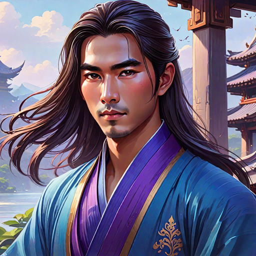
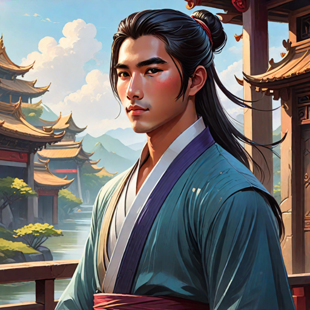

---
tags:
  - Characters
  - Male
  - Stormbringer
  - Royalty
  - Langit
---

# Liwei Tengku

  <strong>Warning!</strong> This article contains spoilers from House of Light.

  
Liwei Tengku

  

    

      <input type="radio" name="liwei-carousel" id="tc1" checked>
      <input type="radio" name="liwei-carousel" id="tc2">
      

        

        

      

      

        <label for="tc1"></label>
        <label for="tc2"></label>
      

    

    <em>AI-generated</em>
  

  
General Information

  <table>
    <tr><th>Full name</th><td>Liwei Tengku</td></tr>
    <tr><th>Also known as</th><td>
      <ul>
        <li>pretty boy (by Tadhana)</li>
      </ul>
    </td></tr>
    <tr><th>Species</th><td>Human</td></tr>
    <tr><th>Status</th><td>Deceased</td></tr>
    <tr><th>Born</th><td>January 13, 515 AA</td></tr>
    <tr><th>Died</th><td>546 AA</td></tr>
    <tr><th>Gender</th><td>Male</td></tr>
    <tr><th>Written Name</th><td>ᜎᜒᜏᜒᜁ ᜆᜒᜅ᜔ᜃᜓ</td></tr>
  </table>
  
Physical Description

  <table>
    <tr><th>Hair</th><td>long and dark</td></tr>
    <tr><th>Eyes</th><td>gray</td></tr>
    <tr><th>Height</th><td>5'9"</td></tr>
    <tr><th>Skin</th><td>medium</td></tr>
  </table>
  
Affiliations

  <table>
    <tr><th>Allegiance</th><td><a href="../world/">Langit</a></td></tr>
    <tr><th>Residence</th><td><a href="../locations/">The Langit Palace, the Hanan Palace</a></td></tr>
    <tr><th>Occupation</th><td>Stormbringer / Prince</td></tr>
    <tr><th>Family</th><td>
      <ul>
        <li>Unknown father</li>
        <li>Chief of Langit (mother, deceased)</li>
        <li><a href="../awang">Awang Tengku</a> (half-brother)</li>
        <li><a href="../chesa">Chesa Tengku</a> (half-sister)</li>
        <li><a href="../bagwis">Bagwis Tengku</a> (half-nephew)</li>
      </ul>
    </td></tr>
  </table>

<!-- 

  
I was not born of flame. I was born beside it — close enough to be scarred, close enough to learn its shape.

  <footer>— Lyra, <a href="#">House of Light</a></footer>

 -->

**Liwei Tengku** (*pronounced: LEE-way*) is a Stormbringer and prince of Langit.

## Biography
Liwei is one of many sons of the Chief of Langit, making him a prince. In his early 20s, he was Blessed with the ability of Stormbringing. In 543 AA, his brother Awang sent him to Hanan as part of their protection force since there are no longer any more Lightbringers in Hanan.

### Early Life

### Events of *House of Light*

*(Write what happens to this character in each book here.)*

## Personality
Liwei does not have any strong morals or values and will play on whatever side is winning. He is often described as ambitious, cold, serious, superiority complex, morally ambiguous, scheming, and power-hungry.

## Abilities & Powers

*(Describe the character's skills, magic, combat abilities, etc.)*

## Relationships

### Tadhana
Liwei meets Tadhana in Lower Hanan and instantly became infatuated with her. He tells her that he thinks she will be the first Lightbringer in decades, and encourages her to go through the Blessing. Tadhana is his love interest for the rest of the series

### Palani
As a Florawielder and the illegitimate son of the Chief of Dokmai, Palani was acquainted with Liwei growing up. Palani is also the cousin of Datu, the Chief of Hanan, and as a result he is the leader of all the Blessed in Hanan. The two become friends when Liwei moves to Hanan.

### Setia
Setia is the Chief of Lautan. In his youth, Liwei spent a few months in the Lautan palace, similar to his current role in Hanan. Him and Setia became close friends.

### Jinhai
Jinhai is a prince of Yinying, the northern Chiefdom currently at war with the southern alliance. Although they have never met personally, Jinhai considers Liwei his mortal enemy. In 537 AA, Liwei executed a princess of Fleun, Rangsea, who was Jinhai's betrothed and first love.

## Trivia

- *(Interesting behind-the-scenes fact or fun detail.)*

## Appearances

- *House of Light*

  <strong>Categories:</strong>
  <a href="../tags/#characters">Characters</a> ·
  <a href="../tags/#male">Female</a> ·
  <a href="../tags/#humans">Humans</a>

