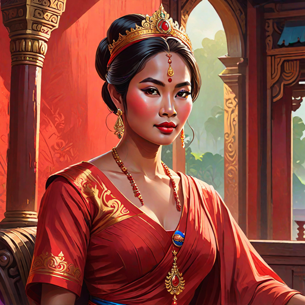

---
tags:
  - Characters
  - Female
  - Chey
  - Flamewielder
  - Fleun
  - Royalty
---

# Jorani Chey

  <strong>Warning!</strong> This article contains spoilers from House of Light.

  
Jorani Chey

  

    
    <em>AI-generated</em>
  

  
General Information

  <table>
    <tr><th>Full name</th><td>Jorani Chey</td></tr>
    <tr><th>Also known as</th><td>
      <ul>
        <li>The Chief of Fleun</li>
      </ul>
    </td></tr>
    <tr><th>Species</th><td>Human</td></tr>
    <tr><th>Status</th><td>Alive</td></tr>
    <tr><th>Gender</th><td>Female</td></tr>
  </table>
  
Physical Description

  <table>
    <tr><th>Hair</th><td>dark</td></tr>
    <tr><th>Eyes</th><td>ember</td></tr>
    <tr><th>Skin</th><td>medium</td></tr>
  </table>
  
Affiliations

  <table>
    <tr><th>Allegiance</th><td><a href="../world/">Fleun</a></td></tr>
    <tr><th>Residence</th><td><a href="../locations/">The Fleun Palace</a></td></tr>
    <tr><th>Occupation</th><td>Chief of Fleun</td></tr>
    <tr><th>Family</th><td>
      <ul>
        <li><a href="../htun">Htun Chey</a> (daughter)</li>
        <li><a href="../minor/rangsea">Rangsea Chey</a> (daughter)</li>
      </ul>
    </td></tr>
  </table>

<!-- 

  
I was not born of flame. I was born beside it — close enough to be scarred, close enough to learn its shape.

  <footer>— Lyra, <a href="#">House of Light</a></footer>

 -->

**Jorani Chey** (*pronounced: jore-AHN-ni*) is the Chief of Fleun and mother of <a href="../htun">Htun Chey</a>.

## Biography

### Early Life

*(Write the character's backstory here.)*

### Events of *House of Light*

*(Write what happens to this character in each book here.)*

## Personality

*(Describe the character's personality, values, and how they change over the course of the story.)*

## Abilities & Powers

*(Describe the character's skills, magic, combat abilities, etc.)*

## Relationships

### [Character Name]

*(Describe the relationship between Lyra and this character.)*

## Trivia

- *(Interesting behind-the-scenes fact or fun detail.)*

## Appearances

- *House of Light* — protagonist

  <strong>Categories:</strong>
  <a href="../tags/#characters">Characters</a> ·
  <a href="../tags/#female">Female</a> ·
  <a href="../tags/#protagonists">Protagonists</a> ·
  <a href="../tags/#humans">Humans</a>

