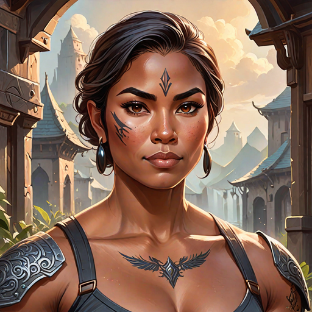

---
tags:
  - Characters
  - Gender
  - Family
  - Blessed
  - House
  - Royalty
---

# Yori

  <strong>Warning!</strong> This article contains spoilers from House of Light.

  
Yori

  

    
    <em>AI-generated</em>
  

  
General Information

  <table>
    <tr><th>Full name</th><td>Yori</td></tr>
    <tr><th>Species</th><td>Human</td></tr>
    <tr><th>Status</th><td>Deceased</td></tr>
    <tr><th>Died</th><td>537 AA</td></tr>
    <tr><th>Gender</th><td>Female</td></tr>
  </table>
  
Physical Description

  <table>
    <tr><th>Hair</th><td>short and dark</td></tr>
    <tr><th>Eyes</th><td>brown</td></tr>
    <tr><th>Distinguishing marks</th><td>facial tattoos</td></tr>
  </table>
  
Affiliations

  <table>
    <tr><th>Allegiance</th><td><a href="../world/">The Bakunawa</a></td></tr>
    <tr><th>Residence</th><td><a href="../locations/">Lower Hanan</a></td></tr>
    <tr><th>Occupation</th><td>Lieutenant of the Bakunawa</td></tr>
  </table>

<!-- 

  
I was not born of flame. I was born beside it — close enough to be scarred, close enough to learn its shape.

  <footer>— Lyra, <a href="#">House of Light</a></footer>

 -->

**Yori** (*pronounced: YOR-ee*) was the Lieutenant of the Bakunawa until she was killed and succeeded by <a href="../tadhana.md">Tadhana Bakunawa</a>

## Biography

### Early Life

*(Write the character's backstory here.)*

### Events of *House of Light*

*(Write what happens to this character in each book here.)*

## Personality

*(Describe the character's personality, values, and how they change over the course of the story.)*

## Abilities & Powers

*(Describe the character's skills, magic, combat abilities, etc.)*

## Relationships

### [Character Name]

*(Describe the relationship between Lyra and this character.)*

## Trivia

- *(Interesting behind-the-scenes fact or fun detail.)*

## Appearances

- *House of Light* — protagonist

  <strong>Categories:</strong>
  <a href="../tags/#characters">Characters</a> ·
  <a href="../tags/#female">Female</a> ·
  <a href="../tags/#protagonists">Protagonists</a> ·
  <a href="../tags/#humans">Humans</a>

