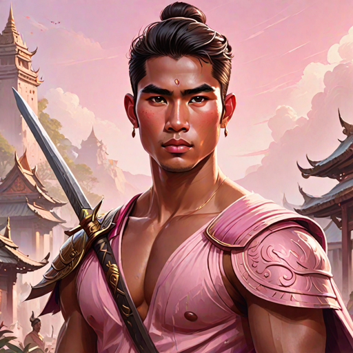

---
tags:
  - Characters
  - Dokmai
  - Royalty
  - Florawielder
  - Tatloan
---

# Palani

  <strong>Warning!</strong> This article contains spoilers from House of Light.

  
Palani

  

    
    <em>AI-generated</em>
  

  
General Information

  <table>
    <tr><th>Full name</th><td>Palani</td></tr>
    <tr><th>Also known as</th><td>
      <ul>
        <li>The Banished Prince</li>
      </ul>
    </td></tr>
    <tr><th>Species</th><td>Human</td></tr>
    <tr><th>Status</th><td>Deceased</td></tr>
    <tr><th>Born</th><td>December 25, 516 AA</td></tr>
    <tr><th>Died</th><td>544 AA</td></tr>
    <tr><th>Gender</th><td>Male</td></tr>
    <tr><th>Written Name</th><td>ᜉᜎᜈᜒ</td></tr>
  </table>
  
Physical Description

  <table>
    <tr><th>Hair</th><td>long and dark</td></tr>
    <tr><th>Eyes</th><td>pink</td></tr>
    <tr><th>Height</th><td>5'9"</td></tr>
    <tr><th>Skin</th><td>dark</td></tr>
  </table>
  
Affiliations

  <table>
    <tr><th>Allegiance</th><td><a href="../world/">The Blessed</a></td></tr>
    <tr><th>Residence</th><td><a href="../locations/">The Dokmai Palace, the Hanan Palace</a></td></tr>
    <tr><th>Occupation</th><td>Florawielder</td></tr>
    <tr><th>Family</th><td>
      <ul>
        <li>The Chief of Dokmai (father)</li>
        <li>Darani (mother)</li>
        <li><a href="../datu">Datu Adlawan</a> (cousin)</li>
        <li><a href="../ahn">Ahn Maniyong</a> (cousin)</li>
        <li><a href="../vatsana">Vatsana Maniyong</a> (cousin)</li>
        <li><a href="../sunya">Sunya Maniyong</a> (cousin)</li>
      </ul>
    </td></tr>
  </table>

<!-- 

  
I was not born of flame. I was born beside it — close enough to be scarred, close enough to learn its shape.

  <footer>— Lyra, <a href="#">House of Light</a></footer>

 -->

**Palani** (*pronounced: pah-LAH-nee*) is a Florawielder from Dokmai.

## Biography
Palani is the illegitimate son of the Chief of Dokmai. In 540 AA, he was sent to be a resident Florawielder of the palace in Hanan for reasons that are not entirely known. There are rumors that he was partially responsible for the death of his little brother, the Chief's favorite son.

### Early Life

*(Write the character's backstory here.)*

### Events of *House of Light*

*(Write what happens to this character in each book here.)*

## Personality
Palani is often described as outgoing, friendly, joking, and flirty. 

## Abilities & Powers

*(Describe the character's skills, magic, combat abilities, etc.)*

## Relationships

### Liwei
As a Florawielder and the illegitimate son of the Chief of Dokmai, Palani was acquainted with Liwei growing up. The two become friends when Liwei moves to Hanan. 
### Tadhana
Liwei meets Tadhana in Lower Hanan and instantly became infatuated with her. He tells her that he thinks she will be the first Lightbringer in decades, and encourages her to go through the Blessing. Tadhana is his love interest for the rest of the series.

## Trivia

- *(Interesting behind-the-scenes fact or fun detail.)*

## Appearances

- *House of Light* — protagonist

  <strong>Categories:</strong>
  <a href="../tags/#characters">Characters</a> ·
  <a href="../tags/#female">Female</a> ·
  <a href="../tags/#protagonists">Protagonists</a> ·
  <a href="../tags/#humans">Humans</a>

