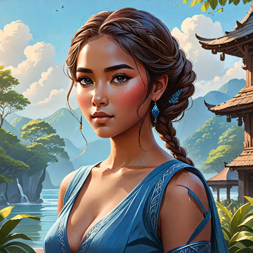

---
tags:
  - Characters
---

# Setia

  <strong>Warning!</strong> This article contains spoilers from House of Light.

  
Setia

  

    
    <em>AI-generated</em>
  

  
General Information

  <table>
    <tr><th>Full name</th><td>Setia</td></tr>
    <tr><th>Also known as</th><td>
      <ul>
        <li>The Chief of Lautan</li>
      </ul>
    </td></tr>
    <tr><th>Species</th><td>Human</td></tr>
    <tr><th>Status</th><td>Alive</td></tr>
    <tr><th>Born</th><td>August 2, 497 AA</td></tr>
    <tr><th>Gender</th><td>Female</td></tr>
    <tr><th>Written Name</th><td>ᜐᜒᜆᜒᜀ</td></tr>
  </table>
  
Physical Description

  <table>
    <tr><th>Hair</th><td>long and brown</td></tr>
    <tr><th>Eyes</th><td>blue</td></tr>
    <tr><th>Height</th><td>5'3"</td></tr>
    <tr><th>Skin</th><td>tan</td></tr>
  </table>
  
Affiliations

  <table>
    <tr><th>Allegiance</th><td><a href="../world/">Lautan</a></td></tr>
    <tr><th>Residence</th><td><a href="../locations/">The Lautan Palace</a></td></tr>
    <tr><th>Occupation</th><td>Chief of Lautan</td></tr>
    <tr><th>Family</th><td>
      <ul>
        <li>Unnamed father</li>
        <li>Unnamed mother</li>
        <li>Dimas (daughter)</li>
        <li>Cahya (son)</li>
        <li>Harun (son)</li>
      </ul>
    </td></tr>
  </table>

<!-- 

  
I was not born of flame. I was born beside it — close enough to be scarred, close enough to learn its shape.

  <footer>— Lyra, <a href="#">House of Light</a></footer>

 -->

**Setia** (*pronounced: suh-tee-AH*) is a Seawielder and the Chief of Lautan.

## Biography

### Early Life

*(Write the character's backstory here.)*

### Events of *House of Light*

*(Write what happens to this character in each book here.)*

## Personality

*(Describe the character's personality, values, and how they change over the course of the story.)*

## Abilities & Powers

*(Describe the character's skills, magic, combat abilities, etc.)*

## Relationships

### Liwei

### Tadhana

### Inzali

## Trivia

- *(Interesting behind-the-scenes fact or fun detail.)*

## Appearances

- *House of Light* — protagonist

  <strong>Categories:</strong>
  <a href="../tags/#characters">Characters</a> ·
  <a href="../tags/#female">Female</a> ·
  <a href="../tags/#protagonists">Protagonists</a> ·
  <a href="../tags/#humans">Humans</a>

