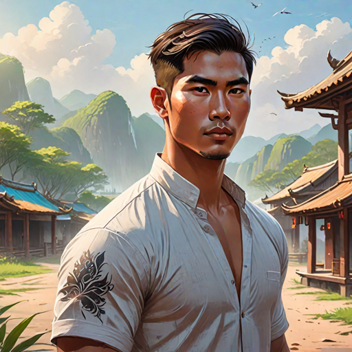

---
tags:
  - Characters
  - Female
  - Protagonists
  - Humans
---

# Som

  <strong>Warning!</strong> This article contains spoilers from House of Light.

  
Som

  

    
    <em>AI-generated</em>
  

  
General Information

  <table>
    <tr><th>Full name</th><td>Som</td></tr>
    <!-- <tr><th>Also known as</th><td>
      <ul>
        <li>The Ashen One</li>
        <li>Lady of Embers</li>
      </ul>
    </td></tr> -->
    <tr><th>Species</th><td>Human</td></tr>
    <tr><th>Status</th><td>Alive</td></tr>
    <tr><th>Born</th><td>July 4, 510 AA</td></tr>
    <tr><th>Died</th><td>AA</td></tr>
    <tr><th>Gender</th><td>Male</td></tr>
  </table>
  
Physical Description

  <table>
    <tr><th>Hair</th><td>short and dark</td></tr>
    <tr><th>Eyes</th><td>green</td></tr>
    <tr><th>Height</th><td>5'8"</td></tr>
    <tr><th>Skin</th><td>fair</td></tr>
  </table>
  
Affiliations

  <table>
    <tr><th>Allegiance</th><td><a href="../world/">The Bakunawa</a></td></tr>
    <tr><th>Residence</th><td><a href="../locations/">The Sonthuy Palace</a></td></tr>
    <tr><th>Occupation</th><td>Stonewielder</td></tr>
    <tr><th>Family</th><td>
      <ul>
        <li>Unnamed father</li>
        <li>Unnamed mother</li>
      </ul>
    </td></tr>
  </table>

  
I went deaf from a childhood illness, and by the time I became an Stonewielder I had lived my entire life in deafness. The Rite did not give me the ability to hear because it merely heals what is broken.

  <footer>— Som, <a href="#">House of Light</a></footer>

**Som** (*pronounced: some*) is a Stonewielder and consort to the Chief of Sonthuy.

## Biography

### Early Life

*(Write the character's backstory here.)*

### Events of *House of Light*

*(Write what happens to this character in each book here.)*

## Personality

*(Describe the character's personality, values, and how they change over the course of the story.)*

## Abilities & Powers

*(Describe the character's skills, magic, combat abilities, etc.)*

## Relationships

### Amihan
### Tadhana

## Trivia

- *(Interesting behind-the-scenes fact or fun detail.)*

## Appearances

- *House of Light* 

  <strong>Categories:</strong>
  <a href="../tags/#characters">Characters</a> ·

