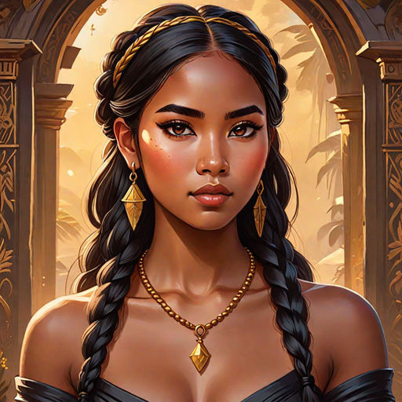
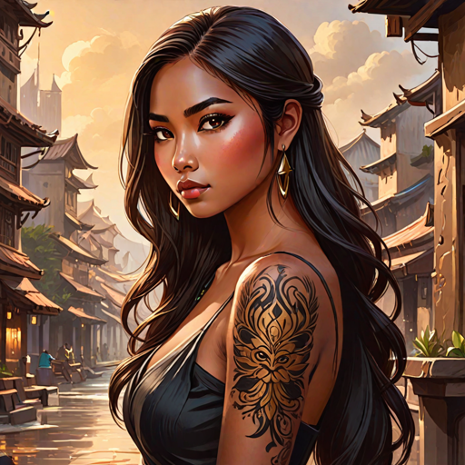
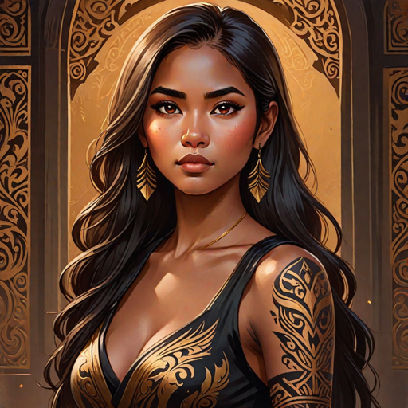

---
tags:
  - Characters
  - Female
  - Protagonists
  - Humans
---

# Tadhana Bakunawa

  <strong>Warning!</strong> This article contains spoilers from House of Light.

  
Tadhana Bakunawa

  

    

      <input type="radio" name="tadhana-carousel" id="tc1" checked>
      <input type="radio" name="tadhana-carousel" id="tc2">
      <input type="radio" name="tadhana-carousel" id="tc3">
      

        

        

        

      

      

        <label for="tc1"></label>
        <label for="tc2"></label>
        <label for="tc3"></label>
      

    

    <em>AI-generated</em>
  

  
General Information

  <table>
    <tr><th>Full name</th><td>Tadhana Bakunawa Adlawan</td></tr>
    <tr><th>Also known as</th><td>
      <ul>
        <li>Nana (by her cousins)</li>
        <li>Tads (by Palani)</li>
      </ul>
    </td></tr>
    <tr><th>Species</th><td>Human</td></tr>
    <tr><th>Status</th><td>Alive</td></tr>
    <tr><th>Born</th><td>June 1, 520 AA</td></tr>
    <tr><th>Gender</th><td>Female</td></tr>
    <tr><th>Written Name</th><td>ᜆᜇ᜔ᜑᜈ ᜊᜃᜓᜈᜏ ᜀᜇ᜔ᜎᜏᜈ᜔</td></tr>
  </table>
  
Physical Description

  <table>
    <tr><th>Hair</th><td>Black, long, straight</td></tr>
    <tr><th>Eyes</th><td>Onyx</td></tr>
    <tr><th>Height</th><td>5'3"</td></tr>
    <tr><th>Skin</th><td>Tan</td></tr>
    <tr><th>Distinguishing marks</th><td>Tattoos and jewelry</td></tr>
  </table>
  
Affiliations

  <table>
    <tr><th>Allegiance</th><td><a href="../world/">The Blessed, The Bakunawa</a></td></tr>
    <tr><th>Residence</th><td><a href="../locations/">Lower Hanan, The Hanan Palace</a></td></tr>
    <tr><th>Occupation</th><td>Shadowbringer</td></tr>
    <tr><th>Family</th><td>
      <ul>
        <li><a href="../kawayan">Kawayan Bakunawa</a> (adoptive father)</li>
        <li><a href="../amihan">Amihan Bakunawa</a> (adoptive cousin)</li>
        <li><a href="../hiwaga">Hiwaga</a> (father, deceased)</li>
        <li><a href="../mayari-2">Mayari Adlwan II</a> (mother, deceased)</li>
        <li><a href="../tala">Tala Adlawan</a> (great-grandmother, deceased)</li>
        <li><a href="../araw">Araw Adlawan</a> / <a href="../linawag">Linawag Adlawan</a> (great-grandfather, deceased)</li>
        <li><a href="../ulupong">Ulupong Bakunawa</a> (adoptive uncle, deceased)</li>
        <li><a href="../sinta">Sinta Bakunawa</a> (adoptive aunt, deceased)</li>
        <li><a href="../bayani">Bayani Bakunawa</a> (adoptive cousin, deceased)</li>
        <li><a href="../habagat">Habagat Bakunawa</a> (adoptive cousin, deceased)</li>
        <li><a href="../mahalia">Mahalia Bakunawa</a> (adoptive cousin, deceased)</li>
      </ul>
  </table>

  
“You’re the most cold-hearted woman I’ve ever met.” “Enough with the flattery.”

  <footer>— Palani, <a href="#">House of Light</a></footer>

**Tadhana Bakunawa** (*pronounced: todd-HAH-na*) is a Shadowbringer of [Hanan](../world/) and the protagonist of *House of Light*.

## Biography

### Early Life
Tadhana was born in a village on the outskirts of the capital city of Hanan. After losing her parents to a village raid, she was found by the Bakunawas and taken to Lower Hanan, where she spent the rest of her childhood.

At age 14, Tadhana became an enforcer for the Bakunawa clan. Since the age of 17, Tadhana has been acting as their leader and the lieutenant of the clan.

### Events of *House of Light*

*(Write what happens to this character in each book here.)*

## Personality
Tadhana is often described as charming, calm and calculated, cold, manipulative, sly, and cunning. Her strengths are that she is efficient, energetic, confident, strong-willed, strategic, charismatic, and persuasive. Her weaknesses are that she is stubborn, dominant, intolerant, impatient, arrogant, cold and ruthless. She likes jewelry, jewels, rare books, drinking, pretty people, fighting, and dressing up. She dislikes confined spaces. She makes lots of eye contact, smirks a lot, has a rigid posture, assertive and manner-of-fact tone. Tadhana's hobby is knowledge - she loves conducting experiments, reading and writing encyclopedias, etc.

## Abilities & Powers
Tadhana was blessed by Yinying with Shadowbringing. She also possesses the ability of Nightmarewielding, and Lightwielding (not to be confused with Lightbringing).

## Relationships

### Bayani
Bayani found Tadhana alone and starving in her village. After she was adopted by his uncle Kawayan, they were raised in Lower Hanan together as childhood friends. Bayani has been in love with Tadhana to his whole life, a fact that is obvious to everyone including Tadhana. When they grew older, Bayani went abroad. While abroad, he sent her many letters with poems written for her.

### Mahalia
Tadhana and Mahalia were raised and tutored together in the Bakunawa clan. 

### Amihan
Amihan has always admired Tadhana and followed her around when they were kids. She is extremely loyal to Tadhana and often acts as Tadhana's right hand. Even after she enlists in the military after the Bakunawa massacre, Amihan remains Tadhana's spymaster.

### Habagat
Like his twin sister, Habagat is extremely loyal to Tadhana. They often bond over their shared love of fighting.

### Liwei
Tadhana meets Liwei in Lower Hanan shortly after her 23rd birthday. Unbeknowngst to her, Liwei is a member of the an elite warrior clan the Blessed as well as the prince of Langit.

### Jinhai
Tadhana first meets Jinhai at the Sonthuy tournament. They try several times to kill each other. After the Battle in Fleun, they form a shaky alliance and eventually fall in love.

### Som

### Htun

### Ahn

### Setia

### Diwata
Tadhana pursued Diwata and eventually charmed her into a relationship when they were 17. Diwata was her first real love and would remain so until 6 years later when she dated Liwei. Tadhana used the information Diwata gave her and ultimately wiped out the Diyagbila clan, but secretly set up a new life for Diwata in Lautan. Diwata cursed Tadhana before she left and expressed her hope that someone would break her heart and ruin her life the way Tadhana did hers.

## Trivia
- Tadhana secretly loves hugs.
- She once hosted a wrestling competition in which the winner won a date with her. 

## Appearances

- *House of Light* — protagonist

  <strong>Categories:</strong>
  <a href="../tags/#characters">Characters</a> ·
  <a href="../tags/#female">Female</a> ·
  <a href="../tags/#protagonists">Protagonists</a> ·
  <a href="../tags/#humans">Humans</a>

